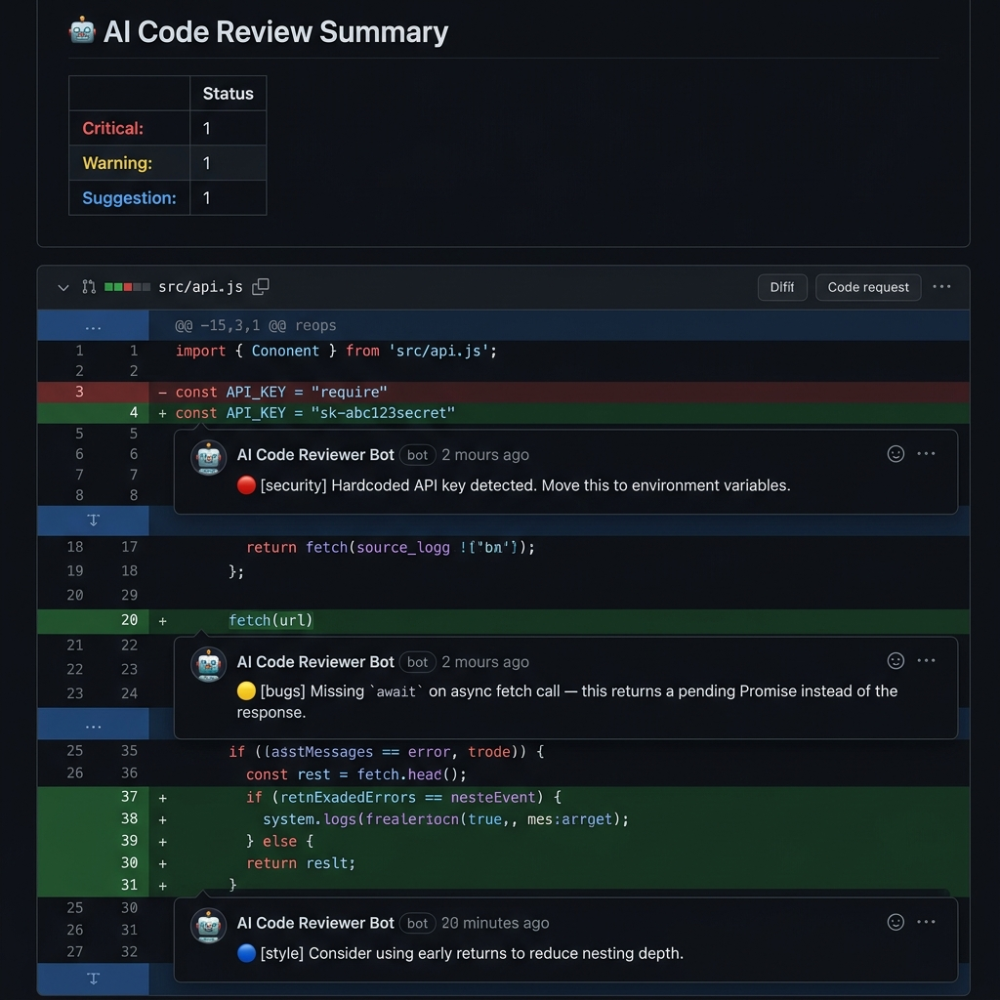

# 🤖 AI Code Reviewer — GitHub Bot


An AI-powered GitHub bot that **automatically reviews pull requests** using **Google Gemini**. It analyzes code diffs and posts structured, actionable inline comments on bugs, security risks, performance issues, style problems, and best practice violations.

### 💡 Why I Built This

Code reviews are the biggest bottleneck in most teams — senior engineers spend hours every week reviewing PRs, and even then, subtle bugs, security flaws, and style inconsistencies slip through. I built this bot to solve that problem: a zero-config AI reviewer that catches the mechanical issues instantly, so human reviewers can focus on architecture, design, and mentoring. The hardest engineering challenge was parsing unified diffs and mapping AI-generated line references back to GitHub's review position API — which turned out to be a deep rabbit hole into how Git represents changes.

---

## 🎬 Demo

> The bot automatically reviews every PR and posts inline comments with severity-tagged feedback:

<p align="center">
  
</p>

---

## ✨ Features

| Feature | Description |
|---------|-------------|
| 🔍 **Automatic PR Reviews** | Triggers on every PR opened or updated |
| 🧠 **Gemini-Powered Analysis** | Uses Google Gemini for intelligent, context-aware code review |
| 💬 **Inline Comments** | Posts review comments directly on the relevant lines |
| 🏷️ **Severity Levels** | Categorizes issues as 🔴 Critical, 🟡 Warning, or 🔵 Suggestion |
| 📊 **Review Summaries** | Posts a summary table with issue counts per severity |
| ✅ **Commit Status Checks** | Sets pass/fail status based on critical issues found |
| 🔄 **Re-review Command** | Comment `/review` on any PR to trigger a fresh review |
| 🚫 **Smart Filtering** | Skips lock files, images, build artifacts, and minified code |

---

## 📦 Architecture

```
AI-code-reviewer-GitHub-bot/
├── index.js              # Probot app — event handlers & GitHub API
├── src/
│   ├── reviewer.js       # Review engine — orchestrates the pipeline
│   ├── parser.js         # Unified diff parser
│   └── prompt.js         # Gemini system prompt & review criteria
├── tests/
│   └── parser.test.js    # Unit tests for the diff parser
├── .env.example          # Environment variable template
├── .gitignore
├── package.json
└── README.md
```

### Review Pipeline

```
PR Event → Fetch Diff → Parse Files → Filter → Send to Gemini → Map to Inline Comments → Post Review
```

1. **Event**: Probot receives a `pull_request.opened` or `pull_request.synchronize` webhook
2. **Fetch**: Retrieves the raw unified diff from GitHub's API
3. **Parse**: Splits the diff into per-file objects with metadata
4. **Filter**: Removes lock files, images, build artifacts, and oversized diffs
5. **AI Review**: Sends file diffs + PR context to Google Gemini with structured review criteria
6. **Map**: Validates AI output and maps issues to exact diff line numbers
7. **Post**: Submits inline review comments + summary table on the PR

---

## 🚀 Setup

### Prerequisites

- **Node.js** ≥ 18
- A **GitHub App** ([create one here](https://github.com/settings/apps/new))
- A **Google Gemini API key** ([get one here](https://aistudio.google.com/apikey))

### 1. Clone the Repository

```bash
git clone https://github.com/1tsadityaraj/AI-code-reviewer-GitHub-bot-.git
cd AI-code-reviewer-GitHub-bot-
npm install
```

### 2. Create a GitHub App

Go to [GitHub Settings → Developer settings → GitHub Apps](https://github.com/settings/apps/new) and configure:

| Setting | Value |
|---------|-------|
| **Webhook URL** | Your server URL (e.g. `https://your-domain.com/api/webhook`) |
| **Webhook Secret** | A random secret string |
| **Permissions** | `Pull Requests: Read & Write`, `Issues: Read & Write`, `Commit Statuses: Read & Write`, `Contents: Read` |
| **Subscribe to events** | `Pull request`, `Issue comment` |

After creating the app:
- Note the **App ID**
- Generate and download a **Private Key** (`.pem` file)
- Install the app on your repository

### 3. Configure Environment

```bash
cp .env.example .env
```

Edit `.env` with your values:

```env
APP_ID=123456
PRIVATE_KEY_PATH=./private-key.pem
WEBHOOK_SECRET=your_secret_here
GEMINI_API_KEY=your_gemini_api_key_here
```

### 4. Run the Bot

```bash
# Development
npm run dev

# Production
npm start
```

---

## 🎯 Review Criteria

The bot evaluates code across 5 categories:

| Category | What It Catches |
|----------|----------------|
| **🐛 Bugs** | Logic errors, null/undefined issues, off-by-one errors, missing error handling |
| **🔒 Security** | Injection risks, exposed secrets, insecure defaults, auth bypass |
| **⚡ Performance** | Unnecessary loops, blocking async calls, memory leaks |
| **🎨 Style** | Naming inconsistencies, dead code, overly complex logic |
| **📋 Best Practices** | Missing tests, improper error propagation, missing types |

### Review Rules

- Only comments on lines **present in the diff**
- Each comment is **1-2 sentences max**
- Issues are assigned a **severity**: critical, warning, or suggestion
- Same issue type is **not repeated more than 3 times** across the review
- **No praise** — only flags problems

---

## 🔄 Commands

| Command | Description |
|---------|-------------|
| `/review` | Post this as a comment on any PR to trigger a fresh AI review |

---

## 🧪 Testing

```bash
npm test
```

---

## 🌐 Deployment

### Deploy to Railway / Render / Fly.io

1. Set the environment variables from `.env.example` in your hosting platform
2. Upload your GitHub App private key as a secret
3. Set the start command to `npm start`
4. Update your GitHub App's webhook URL to point to your deployed server

### Deploy with Docker

```dockerfile
FROM node:18-alpine
WORKDIR /app
COPY package*.json ./
RUN npm ci --production
COPY . .
CMD ["npm", "start"]
```

---

## 📄 License

MIT © [1tsadityaraj](https://github.com/1tsadityaraj)
